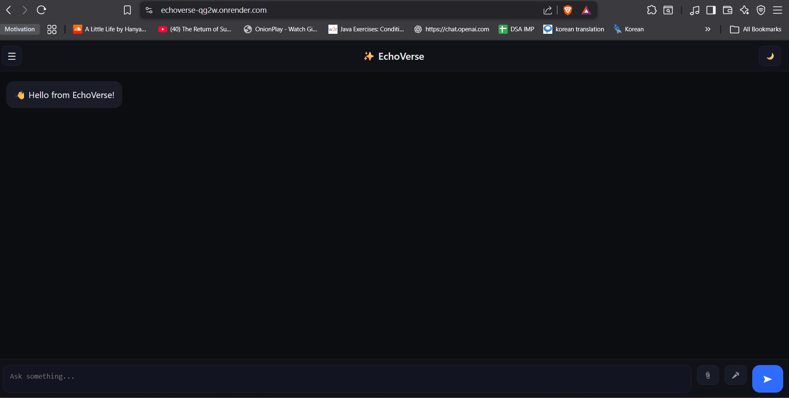

# EchoVerse – AI Chatbot Web Application  
> 🚀 Fullstack project developed as part of internship assessment.  
> Focus: Real-world thinking, clean architecture, documentation & deployment.

---

## 📌 Tracks Covered

| Track | Status | Description |
|------|--------|-------------|
| **Track 1 – Frontend (Mock Data)** | ✔ Completed | Responsive UI using HTML/CSS/JS |
| **Track 2 – Backend (API)** | ✔ Completed | Flask API integration + JSON storage |
| **Track 3 – Fullstack (Web + API)** | ✔ Completed | Integrated frontend + backend + API + deployment |

📌 _Fullstack track automatically covers both frontend & backend evaluation as per assignment instructions._

---

## 🔗 Live Deployment (Render Hosted)

👉 **https://echoverse-qg2w.onrender.com**

⚠ NOTE: Free Render instance — first response may take **20–40 seconds** to load.

---

## 🛠 Tech Stack Used

| Layer | Technology |
|------|-------------|
| Frontend | HTML, CSS, JavaScript |
| Backend | Flask (Python) |
| API Integration | OpenAI / Gemini API |
| Deployment | Render |
| Version Control | Git & GitHub |

---

## 📂 Folder Structure

Echoverse/
- static/ # CSS / JS / audio files
- templates/ # HTML frontend
- screenshots/ # UI preview images
- app.py # Flask backend
- requirements.txt # Dependencies
- .env (ignored) # API keys
- .gitignore # Security configs
- README.md


---

## 📸 Screenshots (UI Preview)

### 🖥️ Chat Interface  


📌 *Short demo/recording can be added here if needed.*

---

## ⚙️ Setup Instructions (Local Run)

```bash
# 1️⃣ Clone the repository
git clone https://github.com/LavanyaMandal/Echoverse.git
cd Echoverse

# 2️⃣ Create & activate virtual environment
python -m venv venv
venv\Scripts\activate     # Windows
# OR
source venv/bin/activate  # Mac/Linux

# 3️⃣ Install dependencies
pip install -r requirements.txt

# 4️⃣ Create .env file in root folder
OPENAI_API_KEY=your_api_key_here

# 5️⃣ Run the application
python app.py
# Open in browser:
http://127.0.0.1:5000/
```


## 🧠 Assumptions

- User interacts directly through a web browser  
- API response delay may occur due to free-tier Render hosting  
- JSON-based chat memory is used (lightweight & fast)  
- `.env` file must contain a valid API key before running  
- Voice output depends on browser speech synthesis support   


## 💡 Bonus Features Implemented (Fully Working)

| Feature | Description |
|--------|-------------|
| Text-to-Speech (TTS) reply | Chatbot speaks responses like a voice assistant |
| Multilingual chat support | Chat continues in Hindi, French, Spanish, etc. |
| Personality switching | Assistant mood: fun / developer / teacher / professional |
| Voice-to-voice interaction | Chatbot responds using web speech API |
| Reminder assistant feature | Users can set reminders inside chat |
| Secure `.env` protection | API keys safely ignored in GitHub repo |
| Responsive UI | Works smoothly across devices |
| Live deployment on Render | Accessible publicly across the internet |


## 🚀 Future Enhancements

| Feature | Purpose |
|--------|---------|
| SQLite / MongoDB storage | Save permanent chat history per user |
| Authentication system | Personalize user experience & secure chats |
| Dark / Light mode | Better UI experience |
| Complete CRUD employee/task API | Backend track enhancement |
| React / Vue frontend version | Modern UI scalability |
